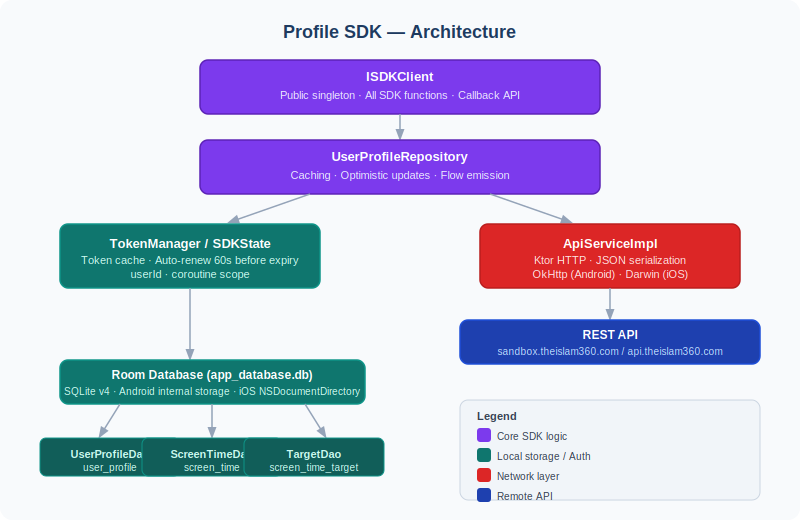

# Profile SDK — Developer Documentation

**Version:** 1.0.4  
**Platform:** Kotlin Multiplatform (Android + iOS)  
**Sandbox URL:** `https://sandbox.theislam360.com/`  
**Production URL:** `https://api.theislam360.com/`

---

## Table of Contents

1. [Overview](#overview)
2. [Architecture](#architecture)
3. [Installation](#installation)
   - [Android](#android-installation)
   - [iOS](#ios-installation)
4. [Initialization](#initialization)
5. [Authentication — Token Management](#authentication--token-management)
6. [Profile](#profile)
   - [Observe Profile (Live)](#observe-profile-live)
   - [Upsert Profile (First Login)](#upsert-profile-first-login)
   - [Update Profile (Partial)](#update-profile-partial)
   - [Get Complete Profile Data](#get-complete-profile-data)
7. [Subscription](#subscription)
8. [Profile Views](#profile-views)
9. [Screen Time](#screen-time)
   - [Observe Screen Time (Live)](#observe-screen-time-live)
   - [Post Screen Time](#post-screen-time)
10. [Nearby Users](#nearby-users)
11. [Data Models](#data-models)
12. [Error Handling](#error-handling)
13. [Result Type](#result-type)
14. [Cancellable Observations](#cancellable-observations)
15. [Local Database](#local-database)
16. [API Reference](#api-reference)

---

## Overview

The Profile SDK is a **Kotlin Multiplatform (KMP)** library that provides a unified API for managing user profiles, screen time tracking, subscriptions, profile views, and nearby user discovery. The same business logic runs on both Android and iOS — only the SQLite driver and HTTP engine differ per platform.

Key characteristics:

- **Offline-first:** Profile and screen-time data are persisted locally in a Room database. Observers emit cached data instantly, then re-emit when a fresh API response arrives.
- **Optimistic updates:** `updateProfile` writes to the local DB immediately, then syncs with the server. On failure the local state is rolled back.
- **Token auto-renewal:** Once a token is generated it is cached for its full lifetime and renewed 60 seconds before expiry — callers never need to refresh manually.
- **Callback-based API:** All async operations use Kotlin callbacks (`onResult`, `onEach`, `onError`) so they are easy to consume from both Kotlin and Swift without coroutine knowledge.
- **Sandbox / Production toggle:** Pass `sandboxMode = true` (default) or `false` at initialization to switch environments without rebuilding.

---

## Architecture



**Flow of data for observed operations (e.g., `observeProfile`):**

1. The Room `Flow` emits the locally cached value immediately (if any).
2. An API refresh is triggered in parallel on a background coroutine.
3. When the API response arrives it is written to the database, which triggers a second emission from the `Flow`.

---

## Installation

### Android Installation

The SDK is published to GitHub Packages as a Maven artifact.

**1. Add the GitHub Packages repository** to your project's `settings.gradle.kts`:

```kotlin
dependencyResolutionManagement {
    repositories {
        maven {
            name = "GitHubPackages"
            url = uri("https://maven.pkg.github.com/islamic-technology-mission/itm-profile-sdk")
            credentials {
                username = providers.gradleProperty("github.actor").orNull
                    ?: System.getenv("GITHUB_ACTOR")
                password = providers.gradleProperty("github.token").orNull
                    ?: System.getenv("GITHUB_TOKEN")
            }
        }
    }
}
```

**2. Add the dependency** in your app `build.gradle.kts`:

```kotlin
dependencies {
    implementation("com.itm.profilesdk:profile-sdk:1.0.4")
}
```

**3. Add Internet permission** in `AndroidManifest.xml`:

```xml
<uses-permission android:name="android.permission.INTERNET" />
```

**Requirements:**

| Requirement | Value |
|---|---|
| Min SDK | 24 (Android 7.0) |
| Compile SDK | 36 |
| Kotlin | 2.1.x |

---

### iOS Installation

The SDK is distributed as a CocoaPod wrapping a prebuilt `Profile_SDK.framework` (XCFramework built by Gradle).

**1. Generate the framework** (run once, or after SDK changes):

```bash
./gradlew :profile-sdk:generateDummyFramework
```

**2. Add the pod** to your `Podfile`:

```ruby
pod 'Profile-SDK', :path => '../path/to/profile-sdk'
```

**3. Install:**

```bash
pod install
```

**4. Build:** The pod script phase automatically invokes `./gradlew :profile-sdk:syncFramework` before Xcode compiles your target.

**Requirements:**

| Requirement | Value |
|---|---|
| iOS Deployment Target | 15.0+ |
| Architectures | arm64 (device), x86_64 + arm64 (simulator) |

**Import in Swift:**

```swift
import Profile_SDK
```

---

## Initialization

The SDK behaves as a singleton: it is set up once, then consumed everywhere else. There are three entry points:

- **`ISDKClient.setup()`** — one-time, app-level setup (DB, HTTP client, repository). Call exactly once, typically in `Application.onCreate()` (Android) or `application(_:didFinishLaunchingWithOptions:)` (iOS). Safe to call again — it's always a no-op once the singleton exists. If a userId was previously set via `initialize()` and never cleared by `logout()`, `setup()` automatically restores it (see [Persisted user](#persisted-user) below).
- **`ISDKClient.initialize(userId)`** — sets the "current" user, used only by the convenience overloads that don't take an explicit `userId` (e.g. `observeProfile(token, ...)`, `generateToken(...)`). Requires `setup()` to have already run — call it once you know who's logged in. The userId is persisted to disk.
- **`ISDKClient.logout()`** — fully tears down the singleton: closes the DB connection, and drops the repository, HTTP client, token manager, current user, and persisted userId. Call this on logout, or when switching to a different user. After `logout()`, call `setup()` again before `initialize()` — see [Logging out / switching users](#logging-out--switching-users) below.

Every function that takes an explicit `userId` parameter (e.g. `observeScreenTime(userId, token, days, ...)`, `getCompleteProfileData(userId, token, ...)`) only needs `setup()` to have run once — you do **not** need to call `initialize()` at all to act on a different user.

### Persisted user

Calling `initialize(userId)` writes the userId to local storage (`SharedPreferences` on Android, `NSUserDefaults` on iOS), scoped to the app. On the next process start, `setup()` reads it back automatically — so a logged-in user stays "current" across app restarts without your app having to call `initialize()` again. The persisted value is cleared by `logout()`, so once you log a user out, `setup()` will not restore anyone until `initialize()` is called again.

### Parameters — `setup()`

| Parameter | Type | Default | Description |
|---|---|---|---|
| `sandboxMode` | `Boolean` | `true` | `true` → sandbox URL, `false` → production URL |
| `context` | `Any` | `Unit` | Android: pass `applicationContext`. iOS: omit. |

### Parameters — `initialize()`

| Parameter | Type | Default | Description |
|---|---|---|---|
| `userId` | `String` | required | Authenticated user's UUID |

### Android

```kotlin
class MyApplication : Application() {
    override fun onCreate() {
        super.onCreate()
        // One-time app setup — do this once, regardless of which user is logged in
        ISDKClient.setup(
            sandboxMode = true,   // false for production
            context     = this
        )
    }
}

// Later, once you know who's logged in:
ISDKClient.initialize(userId = "user-uuid-here")
```

### iOS (Swift)

```swift
// context is not needed on iOS — omit it
ISDKClient.shared.setup(sandboxMode: true)
ISDKClient.shared.initialize(userId: "user-uuid-here")
```

**Notes:**

- `initialize()` requires `setup()` to have already run — it throws `IllegalStateException` otherwise.
- `userId` must not be blank; the SDK throws `IllegalArgumentException` otherwise.
- `sandboxMode` defaults to `true` on `setup()`. Switch to `false` for production releases.
- If you only ever call functions with an explicit `userId` param, `initialize(userId)` is optional — `setup()` alone is enough.
- On app relaunch, if `initialize(userId)` was called in a previous session and `logout()` was never called, `setup()` restores that userId automatically — you don't need to call `initialize()` again just because the process restarted.

---

## Logging out / switching users

`ISDKClient.logout()` fully tears down the singleton — closes the DB connection, and drops the repository, HTTP client, token manager, current user, and the persisted userId. After `logout()`, the SDK is back to an uninitialized state; you must call `setup()` again before `initialize()` will work.

```kotlin
// on logout, or to switch users:
ISDKClient.logout()

// later (e.g. next login):
ISDKClient.setup(sandboxMode = true, context = applicationContext)
ISDKClient.initialize(userId = "new-user-uuid")
```

**Calling functions before `setup()`/`initialize()` (or after `logout()`):** every SDK function fails gracefully instead of crashing. Callback-style functions (`getCompleteProfileData`, `updateProfile`, `getSubscription`, etc.) deliver `Result.Error("SDK not configured...")` to their `onResult` callback. Flow-style functions (`observeProfile`, `observeScreenTime`) deliver the error to their `onError` callback. Nothing throws an uncaught exception.

---

## Authentication — Token Management

The SDK provides a built-in token generation mechanism using an **X-Internal-Key** (provided by the team). The resulting `idToken` is a Bearer token that must be passed to every SDK API call.

**How token lifecycle works:**

- The token is fetched from `POST /api/v1/internal/generate-token` with the `X-Internal-Key` header.
- It is cached in memory for its declared lifetime (default: 3600 seconds).
- 60 seconds before expiry the SDK auto-renews — callers do not need to call `generateToken` again.
- On user switch (`initialize()` with a new userId) the cached token is cleared.

---

## Profile

### Observe Profile (Live)

Emits the cached profile immediately (if available), then re-emits whenever the API returns fresh data. Returns a `Cancellable` — call `.cancel()` when done (e.g., in `onDestroy` or `deinit`).

**Observe the current user's own profile:**

```kotlin
// Android / Kotlin
val cancellable = ISDKClient.observeProfile(
    token  = idToken,
    onEach = { profile ->
        // Called with cached value first, then updated value
        println("Name: ${profile.name}")
    },
    onError = { error ->
        println("Error: ${error.message}")
    }
)

// Cancel when done
cancellable.cancel()
```

```swift
// iOS Swift
let cancellable = ISDKClient.shared.observeProfile(
    token: idToken,
    onEach: { profile in
        print("Name: \(profile.name ?? "")")
    },
    onError: { error in
        print("Error: \(error.localizedDescription)")
    }
)

// Cancel (e.g., in deinit)
cancellable.cancel()
```

**Observe another user's profile** (pass an explicit `userId`):

```kotlin
val cancellable = ISDKClient.observeProfile(
    userId = "other-user-uuid",
    token  = idToken,
    onEach = { profile -> /* ... */ },
    onError = { error -> /* ... */ }
)
```

---

### Upsert Profile (First Login)

Creates or idempotently merges a profile. Use this on first login to seed profile data from the authentication provider.

```kotlin
// Android / Kotlin
ISDKClient.upsertProfile(
    token = idToken,
    request = UpsertProfileRequest(
        name       = "Ahmed Ali",
        email      = "ahmed@example.com",
        phone      = "+971501234567",
        gender     = "male",
        dob        = "1990-01-15",
        platform   = "android",
        visibility = "public",
        umrahOptIn = true,
        location   = UserLocation(lat = 24.68, lng = 46.72, geohash = "thmz")
    )
) { result ->
    when (result) {
        is Result.Success -> println("Profile created: ${result.data.id}")
        is Result.Error   -> println("Error: ${result.message}")
    }
}
```

```swift
// iOS Swift
let request = UpsertProfileRequest(
    name: "Ahmed Ali",
    email: "ahmed@example.com",
    phone: "+971501234567",
    gender: "male",
    dob: "1990-01-15",
    platform: "ios",
    visibility: "public",
    umrahOptIn: true,
    location: UserLocation(lat: 24.68, lng: 46.72, geohash: "thmz", updatedAt: nil, city: "Riyadh", country: "SA")
)

ISDKClient.shared.upsertProfile(token: idToken, request: request) { result in
    // handle result
}
```

---

### Update Profile (Partial)

Updates only the fields provided — all fields are optional. `Subscription` and `ProfileViews` cannot be updated through this call.

The update is **optimistic**: the local DB is updated immediately, the UI reflects changes instantly, and the server is updated in parallel. On server error the local state is rolled back.

**Update the current user:**

```kotlin
ISDKClient.updateProfile(
    token = idToken,
    request = UpdateProfileRequest(
        name       = "Ali Hassan",
        imageUrl   = "https://cdn.example.com/avatar.jpg",
        visibility = "private",
        umrahOptIn = false
    )
) { result ->
    when (result) {
        is Result.Success -> println("Updated: ${result.data.name}")
        is Result.Error   -> println("Error: ${result.message}")
    }
}
```

**Update another user** (pass explicit `userId`):

```kotlin
ISDKClient.updateProfile(
    userId  = "other-user-uuid",
    token   = idToken,
    request = UpdateProfileRequest(name = "New Name")
) { result -> /* ... */ }
```

---

### Get Complete Profile Data

Fetches a full snapshot in a single API call: **profile + subscription + screen time (last 7 days) + profile views**. The `profile` and `screenTimeWeek` portions are also saved to the local DB, so a subsequent `observeProfile()` emission will reflect this fresh data.

```kotlin
// Android / Kotlin — current user
ISDKClient.getProfileCompleteData(token = idToken) { result ->
    when (result) {
        is Result.Success -> {
            val data = result.data
            println("Name: ${data.profile?.name}")
            println("Subscription active: ${data.subscription?.active}")
            println("Screen time entries: ${data.screenTimeWeek?.size}")
            println("Profile views: ${data.profileViews?.total}")
        }
        is Result.Error -> println("Error: ${result.message}")
    }
}
```

```swift
// iOS Swift — current user
ISDKClient.shared.getProfileCompleteData(token: idToken) { result in
    if let success = result as? ResultSuccess<UserProfileData> {
        let data = success.data
        print("Name: \(data.profile?.name ?? "")")
        print("Subscription active: \(data.subscription?.active ?? false)")
    }
}
```

**Fetch for another user** (pass explicit `userId`):

```kotlin
ISDKClient.getProfileCompleteData(
    userId = "other-user-uuid",
    token  = idToken
) { result -> /* ... */ }
```

**`UserProfileData` fields:**

| Field | Type | Description |
|---|---|---|
| `profile` | `UserProfile?` | Full user profile |
| `subscription` | `Subscription?` | Active subscription details |
| `screenTimeWeek` | `List<ScreenTimeEntry>?` | Last 7 days of screen time |
| `profileViews` | `ProfileViews?` | Profile view summary |

---

## Subscription

Fetches the user's active subscription live from the API (never cached locally).

```kotlin
ISDKClient.getSubscription(token = idToken) { result ->
    when (result) {
        is Result.Success -> {
            val sub = result.data
            println("Active: ${sub.active}, SKU: ${sub.sku}, Expires: ${sub.expiresAt}")
        }
        is Result.Error -> println("Error: ${result.message}")
    }
}
```

```swift
ISDKClient.shared.getSubscription(token: idToken) { result in
    if let success = result as? ResultSuccess<Subscription> {
        print("Active: \(success.data.active ?? false)")
    }
}
```

---

## Profile Views

Retrieves a **paginated** list of users who viewed the current user's profile. Always fetched live from the API.

```kotlin
// Android / Kotlin — First page
ISDKClient.getProfileViews(
    token  = idToken,
    limit  = 20,
    cursor = null
) { result ->
    when (result) {
        is Result.Success -> {
            val data = result.data
            println("Total views: ${data.total}")
            data.items?.forEach { viewer ->
                println("  ${viewer.name} viewed ${viewer.viewCount} times, last: ${viewer.lastViewedAt}")
            }
            // Load next page
            if (data.hasMore == true) {
                loadNextPage(cursor = data.nextCursor)
            }
        }
        is Result.Error -> println("Error: ${result.message}")
    }
}
```

```swift
// iOS Swift — First page
ISDKClient.shared.getProfileViews(
    token: idToken,
    cursor: nil,
    limit: 20
) { result in
    if let success = result as? ResultSuccess<ProfileViewsData> {
        let data = success.data
        print("Total views: \(data.total ?? 0)")
        data.items?.forEach { viewer in
            print("\(viewer.name ?? "") viewed \(viewer.viewCount ?? 0) times, last: \(viewer.lastViewedAt ?? "")")
        }
        if data.hasMore == true, let nextCursor = data.nextCursor {
            loadNextPage(cursor: nextCursor)
        }
    } else if let error = result as? ResultError {
        print("Error: \(error.message)")
    }
}
```

**Parameters:**

| Parameter | Type | Default | Description |
|---|---|---|---|
| `token` | `String` | required | Bearer token |
| `cursor` | `String?` | `null` | Pagination cursor from previous response |
| `limit` | `Int?` | `null` | Max items per page (server default applies when null) |

---

## Screen Time

### Observe Screen Time (Live)

Emits cached screen time immediately, then re-emits on refresh. The emitted `List<ScreenTimeEntry>` contains one entry per day.

```kotlin
val cancellable = ISDKClient.observeScreenTime(
    token      = idToken,
    days       = 7,            // fetch last 7 days
    onEach     = { entries ->
        entries.forEach { entry ->
            println("${entry.date}: ${entry.minutes} min")
        }
    },
    onError    = { error -> println("Error: ${error.message}") },
    onComplete = { println("Stream closed") }
)

// Cancel when view is destroyed
cancellable.cancel()
```

```swift
let cancellable = ISDKClient.shared.observeScreenTime(
    token: idToken,
    days: 7,
    onEach: { entries in
        for entry in entries {
            print("\(entry.date ?? ""): \(entry.minutes ?? 0) min")
        }
    },
    onError: { error in print("Error: \(error.localizedDescription)") },
    onComplete: { print("Done") }
)
```

**`ScreenTimeProgress` fields** (returned internally, exposed via `entries` in the callback):

| Field | Type | Description |
|---|---|---|
| `targetMinutes` | `Int` | Daily target (default 15 min) |
| `todayMinutes` | `Int` | Minutes logged today |
| `isDailyTargetMet` | `Boolean` | Whether today's target is reached |
| `dailyProgressPercent` | `Float` | 0.0–100.0 |
| `weeklyMinutes` | `Int` | Total minutes in last 7 days |
| `weeklyTargetMinutes` | `Int` | `targetMinutes × 7` |
| `isWeeklyTargetMet` | `Boolean` | — |
| `weeklyProgressPercent` | `Float` | 0.0–100.0 |
| `monthlyMinutes` | `Int` | Total minutes in last 30 days |
| `monthlyTargetMinutes` | `Int` | `targetMinutes × 30` |
| `isMonthlyTargetMet` | `Boolean` | — |
| `monthlyProgressPercent` | `Float` | 0.0–100.0 |
| `entries` | `List<ScreenTimeEntry>` | Raw per-day entries |

---

### Post Screen Time

Appends screen time for a specific date. The server **increments** the stored value (do not send cumulative totals). After posting, the SDK automatically refreshes the local cache.

```kotlin
ISDKClient.postScreenTime(
    token = idToken,
    request = ScreenTimeRequest(
        date    = "2026-06-30",   // ISO date string
        seconds = 300             // 5 minutes = 300 seconds
    ),
    days = 7                      // refresh window after posting
) { result ->
    when (result) {
        is Result.Success -> println("Screen time posted")
        is Result.Error   -> println("Error: ${result.message}")
    }
}
```

```swift
let request = ScreenTimeRequest(date: "2026-06-30", seconds: 300)
ISDKClient.shared.postScreenTime(token: idToken, request: request, days: 7) { result in
    // handle result
}
```

---

## Nearby Users

Fetches public users near a given location. `lat` and `lng` are optional — if omitted, the server falls back to the user's last saved location.

```kotlin
ISDKClient.getNearbyUsers(
    token = idToken,
    lat   = 24.6877,
    lng   = 46.7219
) { result ->
    when (result) {
        is Result.Success -> {
            result.data.forEach { user ->
                println("${user.name} @ ${user.location?.city}")
            }
        }
        is Result.Error -> println("Error: ${result.message}")
    }
}
```

```swift
ISDKClient.shared.getNearbyUsers(token: idToken, lat: 24.6877, lng: 46.7219) { result in
    if let success = result as? ResultSuccess<NSArray> {
        for user in success.data as! [NearbyUser] {
            print("\(user.name ?? "") @ \(user.location?.city ?? "")")
        }
    }
}
```

---

## Data Models

### `UserProfile`

| Field | Type | Description |
|---|---|---|
| `id` | `String` | User UUID (primary key) |
| `name` | `String?` | Display name |
| `email` | `String?` | Email address |
| `phone` | `String?` | Phone number |
| `imageUrl` | `String?` | Profile picture URL |
| `gender` | `String?` | `"male"` / `"female"` |
| `dob` | `String?` | Date of birth (ISO 8601) |
| `platform` | `String?` | `"android"` / `"ios"` |
| `visibility` | `String?` | `"public"` / `"private"` |
| `umrahOptIn` | `Boolean?` | Umrah feature opt-in |
| `migrated` | `Boolean?` | Legacy account flag |
| `whatsappVerified` | `Boolean?` | WhatsApp verification status |
| `location` | `UserLocation?` | Last known location |
| `nearbyUsers` | `Int?` | Count of users nearby |
| `createdAt` | `String?` | ISO 8601 timestamp |
| `updatedAt` | `String?` | ISO 8601 timestamp |

Helper method: `profile.isPublic()` — returns `true` when `visibility == "public"`.

---

### `UserProfileData`

Returned by `getProfileCompleteData()`.

| Field | Type | Description |
|---|---|---|
| `profile` | `UserProfile?` | Full user profile |
| `subscription` | `Subscription?` | Active subscription details |
| `screenTimeWeek` | `List<ScreenTimeEntry>?` | Last 7 days of screen time entries |
| `profileViews` | `ProfileViews?` | Profile view summary |

---

### `UpsertProfileRequest`

| Field | Type | Description |
|---|---|---|
| `name` | `String?` | Display name |
| `email` | `String?` | Email |
| `phone` | `String?` | Phone |
| `gender` | `String?` | `"male"` / `"female"` |
| `dob` | `String?` | Date of birth |
| `platform` | `String?` | `"android"` / `"ios"` |
| `visibility` | `String?` | `"public"` / `"private"` |
| `location` | `UserLocation?` | Current location |
| `umrahOptIn` | `Boolean?` | Opt into Umrah feature |

---

### `UpdateProfileRequest`

All fields optional. Only provided fields are sent to the server.

| Field | Type | Description |
|---|---|---|
| `name` | `String?` | Display name |
| `phone` | `String?` | Phone |
| `imageUrl` | `String?` | Profile picture URL |
| `gender` | `String?` | `"male"` / `"female"` |
| `dob` | `String?` | Date of birth |
| `visibility` | `String?` | `"public"` / `"private"` |
| `location` | `UserLocation?` | Current location |
| `umrahOptIn` | `Boolean?` | Umrah opt-in |

> **Note:** `Subscription` and `ProfileViews` cannot be updated via this SDK.

---

### `UserLocation`

| Field | Type | Description |
|---|---|---|
| `lat` | `Double?` | Latitude |
| `lng` | `Double?` | Longitude |
| `geohash` | `String?` | Geohash string for proximity queries |
| `updatedAt` | `String?` | ISO 8601 timestamp |
| `city` | `String?` | City name |
| `country` | `String?` | ISO country code |

---

### `ScreenTimeRequest`

| Field | Type | Description |
|---|---|---|
| `date` | `String?` | ISO date `"YYYY-MM-DD"` |
| `seconds` | `Int?` | Seconds to add (server increments, not replaces) |

---

### `ScreenTimeEntry`

| Field | Type | Description |
|---|---|---|
| `date` | `String?` | ISO date |
| `minutes` | `Int?` | Total minutes for that day |

---

### `Subscription`

| Field | Type | Description |
|---|---|---|
| `active` | `Boolean?` | Whether subscription is currently active |
| `expiresAt` | `String?` | ISO 8601 expiry timestamp |
| `sku` | `String?` | Product SKU |
| `platform` | `String?` | `"android"` / `"ios"` |

---

### `ProfileViewsData`

| Field | Type | Description |
|---|---|---|
| `total` | `Int?` | Total number of profile views |
| `items` | `List<ProfileViewer>?` | Current page of viewers |
| `nextCursor` | `String?` | Cursor to pass for next page |
| `hasMore` | `Boolean?` | Whether more pages exist |

---

### `ProfileViewer`

| Field | Type | Description |
|---|---|---|
| `viewerUid` | `String?` | Viewer's user ID |
| `name` | `String?` | Viewer's display name |
| `imageUrl` | `String?` | Viewer's avatar URL |
| `lastViewedAt` | `String?` | ISO 8601 timestamp of last view |
| `viewCount` | `Int?` | Total number of views by this user |
| `country` | `String?` | Viewer's country |

---

### `NearbyUser`

| Field | Type | Description |
|---|---|---|
| `id` | `String?` | User ID |
| `name` | `String?` | Display name |
| `imageUrl` | `String?` | Avatar URL |
| `location` | `UserLocation?` | User's location |
| `gender` | `String?` | `"male"` / `"female"` |
| `visibility` | `String?` | `"public"` |

---

## Error Handling

The SDK uses typed `ApiException` subclasses for network errors. These are surfaced in the `Result.Error.cause` field.

| Exception | HTTP Status | When it occurs |
|---|---|---|
| `ApiException.BadRequest` | 400 | Validation failure. `errors` map contains per-field messages. |
| `ApiException.Unauthorized` | 401 | Token missing or expired. |
| `ApiException.Forbidden` | 403 | Authenticated but not authorized. |
| `ApiException.NotFound` | 404 | Resource does not exist. |
| `ApiException.ServerError` | 5xx | Server-side failure. `.code` holds the HTTP status. |
| `ApiException.Unknown` | other | Any other non-2xx response. |

**Handling specific errors:**

```kotlin
ISDKClient.updateProfile(token = idToken, request = request) { result ->
    when (result) {
        is Result.Success -> { /* use result.data */ }
        is Result.Error   -> {
            when (val cause = result.cause) {
                is ApiException.Unauthorized -> {
                    // Token expired — regenerate
                    regenerateToken()
                }
                is ApiException.BadRequest -> {
                    // Show field-level validation errors
                    cause.errors?.forEach { (field, messages) ->
                        println("$field: ${messages.joinToString()}")
                    }
                }
                is ApiException.NotFound -> {
                    println("Profile not found")
                }
                else -> println("Error: ${result.message}")
            }
        }
    }
}
```

---

## Result Type

All one-shot SDK callbacks return `Result<T>`:

```kotlin
sealed class Result<out T> {
    data class Success<T>(val data: T) : Result<T>()
    data class Error(val message: String, val cause: Throwable? = null) : Result<Nothing>()
    data object Loading : Result<Nothing>()
}
```

Convenience extension functions:

```kotlin
result
    .onSuccess { data -> /* use data */ }
    .onError   { message, cause -> /* handle */ }
```

---

## Cancellable Observations

`observeProfile` and `observeScreenTime` return a `Cancellable`. Always cancel it when the UI component is destroyed to prevent memory leaks.

```kotlin
// Android — ViewModel
private var profileObserver: Cancellable? = null

fun startObserving(token: String) {
    profileObserver = ISDKClient.observeProfile(
        token  = token,
        onEach = { profile -> _profileState.value = profile }
    )
}

override fun onCleared() {
    super.onCleared()
    profileObserver?.cancel()
}
```

```swift
// iOS — ViewController
var profileObserver: Cancellable_?   // trailing underscore is the KMP-exported name

override func viewWillAppear(_ animated: Bool) {
    super.viewWillAppear(animated)
    profileObserver = ISDKClient.shared.observeProfile(
        token: token,
        onEach: { [weak self] profile in
            self?.updateUI(profile: profile)
        }
    )
}

deinit {
    profileObserver?.cancel()
}
```

---

## Local Database

The SDK uses **Room KMP** with a bundled SQLite driver (no system SQLite dependency). The database file is named `app_database.db`.

**Storage paths:**

- **Android:** `context.getDatabasePath("app_database.db")` — internal app storage.
- **iOS:** `NSDocumentDirectory/app_database.db`.

**Schema version:** 5 (current)

**Caching strategy:**

| Data | Cached Locally | Strategy |
|---|---|---|
| User Profile | Yes | Emit cache → refresh from API → emit again |
| Screen Time | Yes | Emit cache → refresh from API → emit again |
| Subscription | **No** | Always fetched live from API |
| Profile Views | **No** | Always fetched live from API |
| Nearby Users | **No** | Always fetched live from API |

---

## API Reference

All requests use the configured base URL and require a `Bearer <token>` Authorization header.

| Environment | Base URL |
|---|---|
| Sandbox (default) | `https://sandbox.theislam360.com/` |
| Production | `https://api.theislam360.com/` |

| Method | Endpoint | SDK Function |
|---|---|---|
| `POST` | `/api/v1/internal/generate-token` | `generateToken()` |
| `POST` | `/api/v1/users/{userId}/profile` | `upsertProfile()` |
| `PATCH` | `/api/v1/users/{userId}/profile` | `updateProfile()` |
| `GET` | `/api/v1/users/{userId}/profile` | `observeProfile()` / `getSubscription()` / `getProfileCompleteData()` |
| `GET` | `/api/v1/users/{userId}/profile-views` | `getProfileViews()` |
| `POST` | `/api/v1/users/{userId}/screen-time` | `postScreenTime()` |
| `GET` | `/api/v1/users/{userId}/screen-time?days={n}` | `observeScreenTime()` |
| `GET` | `/api/v1/users/nearby?lat={lat}&lng={lng}` | `getNearbyUsers()` |

**Profile Views query parameters:**

| Param | Type | Description |
|---|---|---|
| `cursor` | `String` | Pagination cursor |
| `limit` | `Int` | Items per page |

**Screen Time query parameter:**

| Param | Type | Description |
|---|---|---|
| `days` | `Int` | Number of past days to retrieve |
